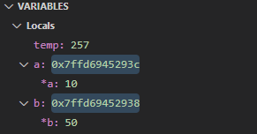
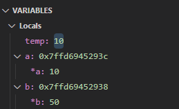
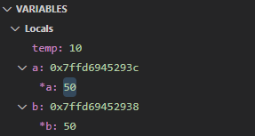
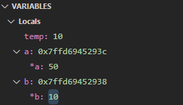
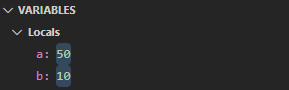

# CS50x Section 4 - Memory

## Pointers

A **pointer** is a variable that **stores** the memory address of another variable as its value. A **pointer variable** points to a variable of the **same data type**, and is created with the `*` operator.

<br>

Let's see **pointers** in action:
```c
int calls = 3;
```
- The `variable` above, like all variables, is a **name** for some **value** that can *change*. Variables are stored in a **hexadecimal addresses** in the computer's memory.

<br>

```c
int *p = &calls;
```
- A `pointer` is an **hexadecimal address** that *references* (points to) another address.

- `int *` is the type.
- `p` is the pointers name.
- `&calls` is the value (variable address) stored in the `p`.

<br>

|Address|Value|Syntax|
|:-:|:-:|:-:|
|0x50000000|**3**|int calls = 3;|
|0x50000004|**0x50000000**|int *p = &calls;|
|0x50000008|...|...|
|0x5000000C|...|...|

<br>

### Key Syntax

- `type *` is a pointer that stores the address of a **type**

- `*x` takes a pointer `x` and gets the value stored at tha address (dereference).

- `&x` takes `x` and gets its address.

<br><br>

Using **pointers** we can pass variables to functions **by reference**, not just **by value**. This will make the code cleaner as a result. 

We also can use **dynamic memory** (e.g., with **malloc**) to write programs that can scale their usage of memory according to user behavior.

<br><br>

## Passing by Copy vs. Passing by Reference

Let's imagine that previously in the `main()` we have declared:
```c
int a = 10;
int b = 50;
```
<br>

Then, we called `swap()` to swap their values:
```c
#include <cs50.h>
#include <stdio.h>

void swap(int a, int b)
{
    int temp = a;
    a = b;
    b = temp;
}
```

```txt
main    a = 10, b = 50

swap    a = 50, b = 10
```

It seems like we achieved the result expected. However, notice that the values of `a` and `b` **remain unchanged** inside the `main()` function. 

This is because the variables `a` and `b` when passed as arguments to the `swap()` function, were **passed by copy**. Manipulating them inside of `swap()` does not affect the **original variables**.

<br><br>

To fix this, we can rewrite `swap()` with **pointers** so we could pass the variables **by reference**:
```c
#include <cs50.h>
#include <stdio.h>

void swap(int *a, int *b)
{
    int temp = *a;
    *a = *b;
    *b = temp;
}
```
```txt
main    a = 50, b = 10
            ^       ^
            ^       ^
swap    a = 50,  b = 10   
```
- This new `swap()` function takes **pointers** to the variables as arguments (the addresses of `a` and `b`).

- It uses **dereference** syntax to access the **actual values** stored in those **addresses** to make permanent changes.

<br>

> [!NOTE]
> We also need to add the `&` **"address of"** operator to `a` and `b` in the function call, to ensure that we pass their **addresses** as arguments:

```c
swap(&a, &b);
```

<br>

Let's see how the full program would look like:
```c
#include <cs50.h>
#include <stdio.h>

// Prototype for swap()
void swap(int *a, int *b);

int main(void)
{
    // Declare and assign values to variables `a` and `b`
    int a = 10;
    int b = 50;

    // Print out values of `a` and `b`
    printf("a is %i, b is %i\n", a, b);

    // Call swap function with addresses(&) of `a` and `b`
    swap(&a, &b);

    // Print out new values of `a` and `b`
    printf("a is %i, b is %i\n", a, b);
}

// The function will take pointers(*) `a` and `b` as arguments
void swap(int *a, int *b)
{
    int temp = *a;
    *a = *b;
    *b = temp;
}
```
```txt
a is 10, b is 50
a is 50, b is 10
```

<br>

### `SWAP()`

We can use `debug50` to **step into** the **swap** function and analyze its inner workings. When the `swap()` function is called in `main()`, the addresses of variables `a` and `b` are passed to it using the **"address of operator"** `&`:

<br>

**1.** `void swap(int *a, int *b)`

<br>



- `temp` holds a **garbage value** of `257`

- Pointer `a` is the address `0x7ffd6945293c`. If we **dereference** (follow) pointer `a` (with operator `*` -> `*a`), we will find it holds value of `10`.

- Pointer `b` is the address `0x7ffd69452938`. If we **dereference** (follow) pointer `b` (`*b`), we will find it holds value of `50`.

<br><br>

**2.** First line `int temp = *a;`

<br>



- Running this line will set the `temp` variable into the result of **dereferencing** the value of pointer `a` (accessing the value it points to), which is `10`.

- `temp` is now `10`.

<br><br>

**3.** Second line `*a = *b;`

<br>



- When this line runs, it will **dereference** the pointer `b` (`*b`) to find the value it is storing, which is `50`.

- Then it will assign the value `50` to the **dereferenced part** of the pointer `a`, replacing the previous value of `10`.

- `*a` is now `50`.

<br><br>

**4.** Third line `*b = temp;`

<br>



- When this line runs, it will set the **dereferencing part** of the pointer `b` to the value of `temp` which is `10`.

- `*b` is now `10`.

<br><br>

**5.** When the `swap()` function is done: 

<br>



- The values stored in the **original variables** `a` and `b` are now swapped at a global level.

<br><br>

The debugging session confirms that the `swap()` function is correctly swapping the values of the variables passed to it **by reference** using **pointers**.

This is reflected in the output produced by the `main()` function, which displays the *updated values* of `a` and `b` after the swap:

```txt
a is 10, b is 50
a is 50, b is 10
```
<br><br>

## File I/O

**File input/output** refers to the **operations** performed on files by **reading** from them or **writing** to them. It's a fundamental aspect of programming, allowing programs to interact with the external files stored on disk.

<br>

### Opening and Closing Files in **C**

<br>

- `fopen` opens a file for future reading/writing.

- `fclose` closes a file.

<br>

> [!IMPORTANT]
> Always `fclose` all files you `fopen`. If not done, it could lead to memory leaks, data loss and synchronization issues.

<br><br>

Let's imagine we wanted to **OPEN** a text file called `hi.txt`:

```c
FILE *f = fopen("hi.txt", "r");
```
- `fopen()` function takes **two arguments** (The file name `"hi.txt"` and the **mode string** `"r"` that specifies to open it in **read mode**).

- `FILE *f` **Pointer variable** named `f` of type `FILE` points to the location of this file in memory.

<br>

To **CLOSE** `hi.txt`:
```c
fclose(f);
```
- To **close** a file, we simply need to give the `fclose()` function the **pointer** to the file as an argument `f`.

<br><br>

### Reading and Writing from Files

<br>

- `fread` reads data from a file into a `buffer`.

- `fwrite` writes data from a `buffer` to a file.

- A `buffer` is a chunk of memory that can temporarily store some data from a file. The reason for using a **buffer** is to avoid **memory overflow**, by accessing small chucks of data at a time in case we have a big file.

<br><br>

To **READ** from a **file**, we should first ask some questions: 

1. **To Where** are we reading (buffer)? 
2. **What Size** is each *block of data* we want to read? 
3. **How Many** *blocks of data* we want to read?
4. **From where** do we want to read (file)?

<br>

Let's imagine we wanted to **read** from `hi.txt`:

```c
fread(buffer,1,4,f);
```
<br>

- `fread()` takes `4` arguments and returns the number of elements successfully read.

- `fread(buffer,...,...,...)` 1st argument is the `buffer`, a **pointer variable** to a memory location we want to **read into** (store file's content).

- `fread(...,size,...,...)` 2nd argument is the `size` of the minimum **units of data** that compose the file (`1 byte` for each `char` in a **text file** or `3 bytes` for each `pixel` in an **image**)

- `fread(...,...,n-units,...)` 3rd argument is to specify how many of those **units of data** we want to read at a time.

- `fread(...,...,...,f)` 4th argument `f` is the **pointer** to the file `hi.txt`.

<br>

> When we **read** data to a **buffer** from a file, the pointer `f` gets updated to point to the next element after the data we read.

<br><br>

### Practice with Reading

<br>

Generally, **files** have a signature of **bytes** at the very beginning that tells us the type of file it is. A `PDF` for example, always begins with a **four-byte** sequence, corresponding to integers `37, 80, 68, 70`.

<br>

Let's create a program called `pdf.c` that opens a file given as a *command-line argument* and determines if it's a `PDF`:

```c
#include <cs50.h>
#include <stdint.h>
#include <stdio.h>

// Declare main function to take command-line arguments
int main(int argc, string argv[])
{
    // Declare 2nd command line argument as filename
    string filename = argv[1];

    // Open file
    FILE *f = fopen(filename, "r");

    // Create buffer to read to of type "1 byte"
    uint8_t buffer[4];

    // Read from file into buffer
    fread(buffer, 1, 4, f);

    // Iterate through first 4 bytes of file
    for (int i = 0; i < 4; i++)
    {
        // Print the 4 bytes
        printf("%i\n", buffer[i]);
    }
    // Close file
    fclose(f);
}
```
<br>

When running `./pdf test.pdf` output confirms file is a `PDF`:
```txt
37
80
68
70
```

<br>

When running `./pdf test.jpg` output shows file is **not** a `PDF`:
```txt
255
216
255
224
```
<br><br>

If we want to print the successful reads that `fread()` function returns, we can modify the code as follows:
```c
#include <cs50.h>
#include <stdint.h>
#include <stdio.h>

int main(int argc, string argv[])
{
    string filename = argv[1];
    FILE *f = fopen(filename, "r");
    uint8_t buffer[4];
    int blocks_read = fread(buffer, 1, 4, f);

    for (int i = 0; i < 4; i++)
    {
        printf("%i\n", buffer[i]);
    }
    printf("Blocks read: %i\n", blocks_read);
    fclose(f);
}
```
```txt
37
80
68
70
Blocks read: 4
```
<br>

In the problem set for this week, we will work with the `fwrite(buffer, 1, 4, f);` function, to write data to the **file** (append) from the **buffer**.
