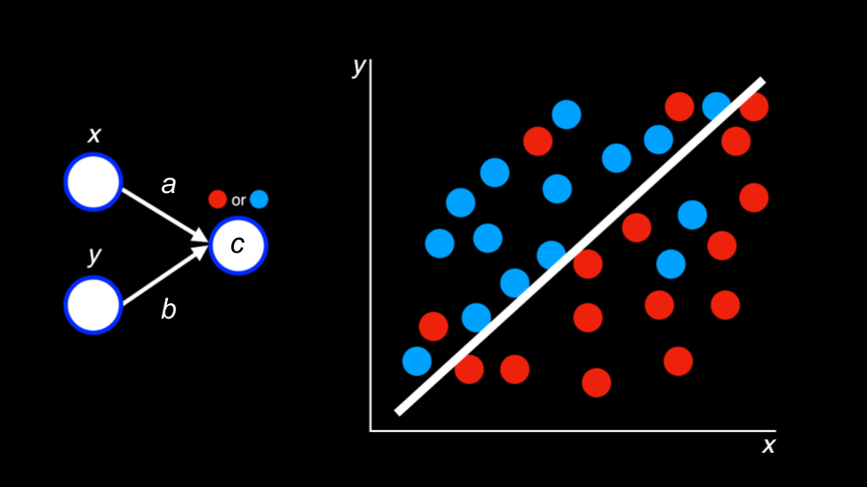
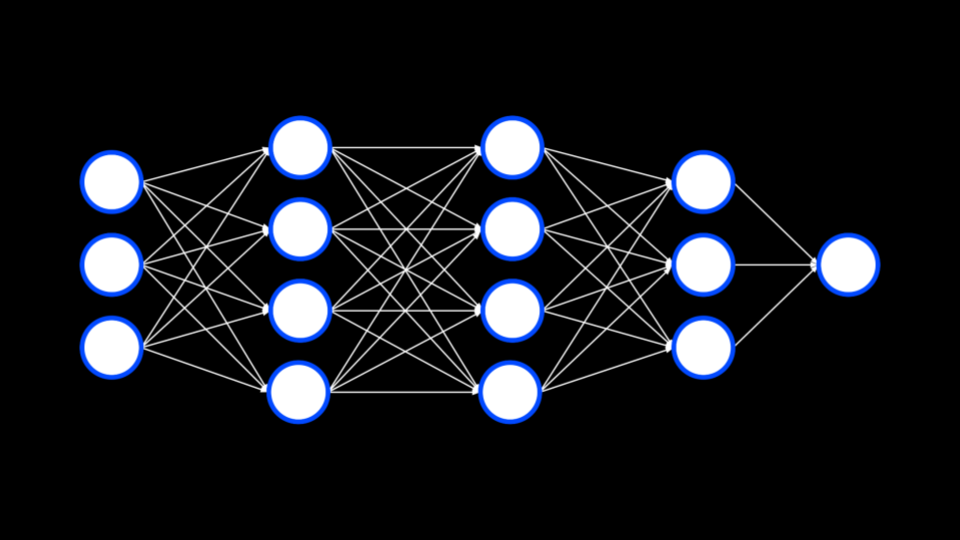

# CS50x Week 6 - Artificial Intelligence

**AI** is a branch of computer science focused on creating systems capable of performing tasks that typically require human intelligence. These tasks include learning, reasoning, problem-solving, and understanding natural language. AI technologies power applications like virtual assistant, autonomous vehicles and personalized recommendations.

## Prompt Generation

**Prompt generation** is a way by which an individual can communicate with an **AI** platform. We use a **system prompt** to teach the **AI** how to interact with users. **User prompts** are those provided by the user interacting with the **AI**.

### System Prompt
```txt
You are a friendly and supportive teaching assistant for CS50.
You are also a rubber duck. Answer student questions only
about CS50 and the field of computer science; do not answer
questions about unrelated topics… Do not provide full answers
to problem sets, as this would violate academic honesty…
```
### User Prompt
```txt
User's questions
```
<br>

In **CS50.dev**, CS50's cloud version of **Visual Studio Code** we can use AI to assist us in writing our code:
- **Highlight** the code and click **Explain Highlighted Code** to have line by line explanation.
- Use **Style50** to get recommendations on the **writing style** of the code and explain the changes.

<br>

## Decision Trees

**Decision trees** are used by an **algorithm** to determine what decision to make. An algorithm may consider what choice to make based on the **instructions** in the **code**.

```txt
            Is ball left of paddle?
            /                   \
          Yes                    No
          /                       \
Move paddle left.           Is ball right of paddle?
                            /                   \
                          Yes                   No
                          /                       \
                Move paddle right.           Don't move the paddle.
```
<br>

In Pseudocode:
```txt
While game is ongoing:
If ball is left of paddle:
    Move paddle left
Else if ball is right of paddle:
    Move paddle right
Else:
    Don't move the paddle
```

> Most games attempt to minimize the number of calculations required to compete with the player.

<br>

## Minimax

**Minimax** is an **algorithm** used as a **decision rule** in **AI**, game theory, and other disciplines, to **minimize** the possible **loss or worst case scenario**. It involves **recursive search** to evaluate possible future moves.  

The **algorithm** looks at a **decision tree** of potential outcomes and **assigns scores** to each potential move. In **tic-tac-toe** the **AI** may consider a board where the computer wins at `1` and one where he loses at `-1`. The computer will then attempt to **maximize** its own **score**.

<br>

```txt

            Can I get 3 in a row this turn?
               /                       \
             Yes                        No
             /                           \
    Play in square to           Can my opponent get 3 in
    get 3 in a row              a row on their next turn?
                                    /               \
                                  Yes                No
                                  /                   \
                   Play in square to block            
                   opponent's 3 in a row.             ???
```
<br>

```txt
MAX (X) aims to maximize score
MIN (O) aims to minimize score

O|X|O       X|O|X       O| |X
O|O|        O|O|X        |X|O
O|X|X       X|X|O       X|O|X

 -1           0           1
```
<br>

```txt
If player is X:
    For each possible move:
        Calculate score for board
    Choose move with highest score

Else if player is O:
    For each possible move:
        Calculate score of the board
    Choose move with lowest score
```
<br>

> **AI** excels at games because they have clear **inputs** and **outputs** that can be represented **mathematically**. A **goal** becomes a **function** to **maximize/minimize**.

<br>

Due to their processing power, computers can analyze a vast number of **potential outcomes**. However, most computers have limitations and may not be able to calculate trillions of options:

- **Tic-Tac-Toe** -> 255,168 Possibilities

- **Chess** - First `4` moves -> 288 million Possibilities

- **Go** - First `4` moves -> 266 quintillion Possibilities

<br>

## Machine Learning

**Machine learning** is a subset of **artificial intelligence** that enables systems to **learn** and **improve** from experience *without* explicit **programming**. It involves training algorithms on **data** to **recognize patterns** and make predictions or decisions.

<br>

### Reinforcement Learning

**Reinforcement learning** is a machine learning technique where the **algorithm** learns to make decisions by taking actions to **maximize rewards**. It involves exploring different strategies, receiving feedback through **rewards** or **penalties** and **adjusting** actions to **improve performance**. 

<br>

```txt
|   |   |   |   |   |
|   | X |   |   |   |
|   |   |   | X |   |
| U | X |   |   |   |
```
- Imagine the computer navigating through the grid above. Every time it moves to a box marked with an `X` it will get a **penalty** (-1 point) and start again. If it moves to an empty box, it will get a **reward** (+1 point). 

- Through this process, the computer is discovering what behaviors to **repeat** and those **not to repeat** and **remembering** them until it can navigate safely through the grid.

<br><br>

#### Explore vs. Exploit

**Exploitation** is **using known action** that have previously yielded high rewards to maximize immediate gains.

**Exploration** is trying **new actions** to discover their potential rewards and learn more about the environment.

Sometimes, not following the known actions can lead to more a efficient performance and yield better outcomes. Optimal decision-making requires finding balance between these strategies to ensure **sufficient learning** and **performance improvements** over time.

<br><br>

Let's implement the **epsilon-greedy** strategy in pseudocode, a common approach to balancing exploration and exploitation in reinforcement learning:
```txt
epsilon = 0.10

If random() < epsilon:
    Make a random move
Else:
    Make the move with the highest value
```
- `epsilon = 0.10:` Sets the exploration rate to `10%`

- `If random() < epsilon` The `random()` function generates a number between `0` and `1`. If this number is **less than** `0.10`, the condition is true:
    - The algorithm will **explore** by making a random move.

- `Else` If random number is **higher or equal to** `0.10`, the condition is false:
    - The algorithm will **exploit** by choosing the move with the **highest known value**.

<br>

## Deep Learning

**Deep learning** is a subset of **machine learning** that uses **neural networks** with multiple layers to model and solve complex problems. It automatically learns to represent features from data, eliminating the need for manual feature extraction.

**Neural networks** are **computational models** inspired by the human brain's structure and function. They consist of **interconnected nodes** organized into **layers** that process information. Through training on data, neural networks can **learn complex patterns** and **make predictions** or **decisions**.



In this example, the **neural network** attempts to **predict** where a **blue** or **red dot** will appear on the graph based on its `x` and `y` coordinates. It might start by assuming that all **blue** dots will appear **left** of the line and all **red** dots will appear to its right, but the **more data** it is introduced to, the **more accurate** the **prediction**.

<br>

- **Inputs**: `x` and `y` represent the **coordinates** of the dot on the graph.

- **Weights**: Each input is **connected** to the **output node** `c`. The weight `a` represents the importance of `x`, and `b` represents the importance of `y` in determining the **color**.

- **Output**: The output node `c` **combines** the **inputs** and **weights** to make a **decision**. 

<br>

We can represent this process mathematically:
```txt
ax + by + c > 0
```
If the combined value `ax` + `by` is **greater than** `0`, the output is **blue**; otherwise, it's **red**.

<br>

> This can be applied to real world scenarios, where `x` could represent **humidity**, `y` could represent **pressure**, and `c` **rainfall**.

<br>

As the problems to be sold become more complex, **neural networks** build multiple layers of **nodes** to capture the patterns in the **data**. Each layer learns to represent features at different levels of abstraction, enabling the network to understand increasingly **complex relationships**.



<br>

## Generative Artificial Intelligence

**Generative AI** refers to **algorithms** that create new content, such as text, images, or music by **learning patterns** from existing data. 

<br>

### Large Language Models 

**Large language models** are advanced **AI** systems that process and generate human-like **text**. They consist of millions or billions of **parameters** and are trained on vast amounts of **text data**. The **AI** encodes words into **embeddings** to find **relationships** and understand context.

<br>

#### Transformer architecture

Each **word** in the **input sentence** is assigned a number representing an **attention value** based on it's relationship with other **words**. If there's a **high relationship** between two words in a sentence, the will have a high **attention value**. 

Using the attention values, the model **generates** the next new word in the output sentence. Through this process, these models learn to understand **context**, generate **coherent responses**, and perform a range of natural language processing tasks.

<br>

```txt
"Massachusetts is a state in the New England region of the Northeastern United States. It borders on the Atlantic Ocean to the east. the state's capital is..."
```
1. The **language model** separates the user input into **words** and takes in account the **order** of those words.

2. The model uses an algorithm to **encode** words in to **embeddings** holding the **mathematical** representation of each word. (Open AI uses **1536** floating point values to represent the word `Massachusets`).

3. The model then **compares** those mathematical values and **assigns** **attention values** based on the relationships of the words to each other and the context.

4. The model feeds those **attention values** as **inputs** into a large **neural network** trained with vast amounts of data which generates the **next words** including in this case hopefully `Boston`, the **capital** of the state of `Massachusets`.

<br>

## Hallucinations

**Hallucinations** in the context of **AI** refer to instances where **language models** generate text that is not **contextually** relevant or accurate. This can occur due to the model's **limited** understanding or **biases** in the training data.

Hallucination highlight the importance of **carefully** evaluating and interpreting outputs from AI systems. As language models get better, the frequency of these hallucinations is reduced.
